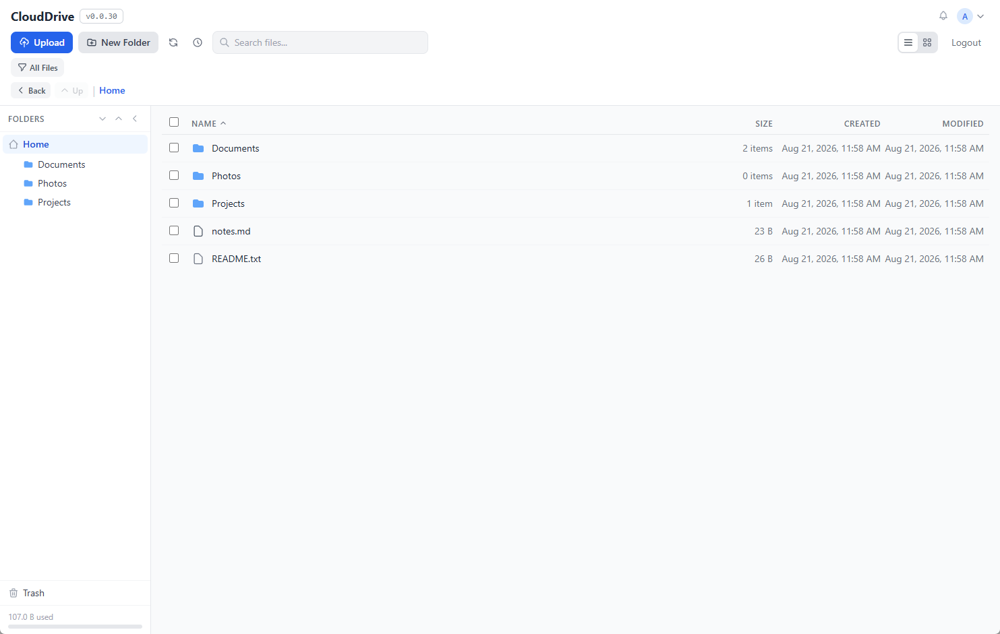
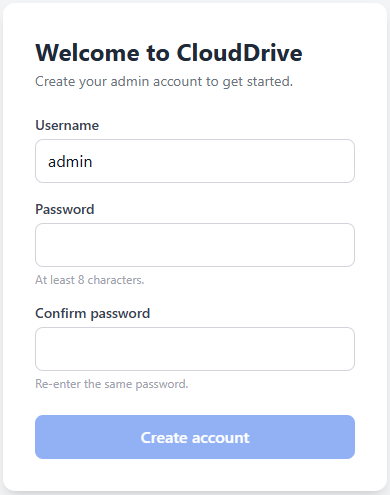
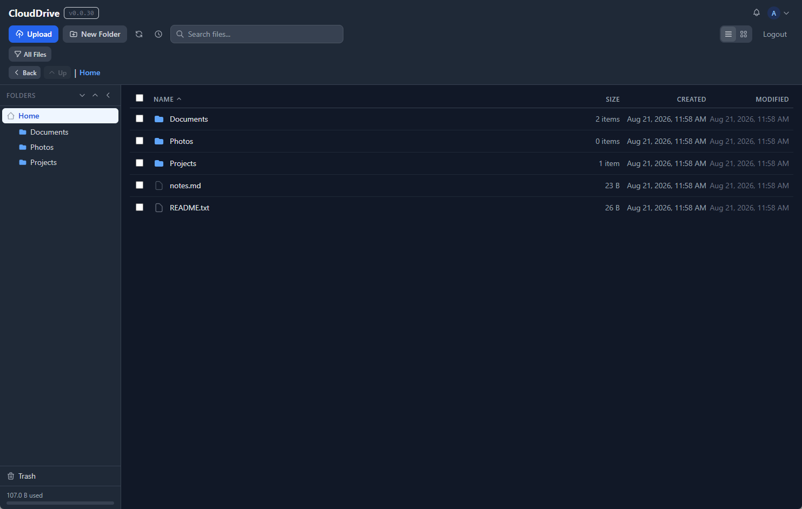

# CloudDrive

**Your files, your server, one command.** CloudDrive is a self-hosted personal cloud — a fast, private alternative to Google Drive / Nextcloud that runs as a **single binary** with **no database**. Your files are just files on disk.


<p align="center">
  
</p>

---

## Quickstart

```bash
docker run -d --name clouddrive -p 8080:8080 -v clouddrive-data:/data ghcr.io/defcons/clouddrive:latest
```

Open **http://localhost:8080**, create your admin account when prompted, and you're in.

That's the whole setup — no config file to write, no secret to generate, no database to provision.

<details>
<summary>Prefer Docker Compose?</summary>

```yaml
# compose.yaml
services:
  clouddrive:
    image: ghcr.io/defcons/clouddrive:latest
    ports:
      - "8080:8080"
    volumes:
      - clouddrive-data:/data
    restart: unless-stopped

volumes:
  clouddrive-data:
```

Then `docker compose up -d` and open http://localhost:8080.
</details>

> **Before exposing it to the internet:** put CloudDrive behind a reverse proxy that terminates HTTPS (Caddy, nginx, Traefik…), and complete the setup wizard immediately on first boot — the first person to reach an un-set-up instance creates the admin.

---

## Features

- 📁 **File manager** — browse (list/grid), drag-and-drop upload (resumable for large files), download, rename, move, copy, zip/unzip, and a trash you can restore from
- 🔍 **Search** — by name, tags, or file contents
- 🖼️ **Previews & thumbnails** — images, video, audio, PDF, text/code, generated on the fly
- 🔗 **Sharing** — public links, password-protected links, upload ("drop-box") shares, all with expiry
- 👥 **Multi-user** — per-user home folders, roles, storage quotas, private folders
- 🕓 **Versions** — automatic file version history with one-click restore
- 🔐 **Security** — bcrypt passwords, optional TOTP two-factor, CSRF protection, audit log, rate limiting
- 🔌 **WebDAV** (opt-in) — mount your drive as a network drive
- ☁️ **Offsite-backup flags** — mark folders for your own backup job to pick up (see [Offsite backup](#offsite-backup))
- 🌓 **Dark mode**, keyboard shortcuts, and an installable PWA

## Configuration

CloudDrive needs **zero configuration** to run — everything below is optional (see [`.env.example`](.env.example)):

| Variable | Default | Purpose |
|---|---|---|
| `STORAGE_ROOT` | `/data` | Where files and metadata live — mount your volume here |
| `JWT_SECRET` | auto-generated | Session-signing secret; generated and persisted on first run if unset |
| `PORT` | `8080` | HTTP port |
| `TRUSTED_PROXIES` | – | Reverse-proxy IPs allowed to set `X-Forwarded-For` (rate-limit accuracy) |
| `WEBDAV_ENABLED` | off | Set to `1` to expose `/webdav` (Basic Auth, HTTPS only) |

To seed the admin non-interactively instead of using the wizard (e.g. automated deploys), set `CLOUDDRIVE_USER` and `CLOUDDRIVE_PASS` before first boot.

## Offsite backup

CloudDrive can **flag** folders for offsite backup, but it deliberately **runs no backups itself** — it only records your choice so your own backup tooling can act on it. Right-click a folder → **Add to Offsite Backup**, and a marker is written to `.backup-tiers.json` at the storage root (`2` = flagged for offsite):

```json
{ "/Documents": 2, "/Photos": 2 }
```

Point any backup tool (restic, rclone, borg, Kopia…) at that file and back up the flagged folders. For example, a nightly restic run that backs up only what's flagged:

```bash
DATA=/path/to/your/data          # your STORAGE_ROOT
jq -r 'to_entries[] | select(.value==2) | .key' "$DATA/.backup-tiers.json" \
  | sed "s#^#$DATA#" \
  | restic backup --files-from -
```

This keeps CloudDrive lightweight and lets you use whatever backup stack you already trust.

## Screenshots

**Zero-config first run** — no config files, no secret to generate, just create your admin account:

<p align="center">
  
</p>

**Built-in dark mode** (and light):

<p align="center">
  
</p>

## Security

CloudDrive has been through several rounds of security hardening: per-user path confinement, traversal and zip-slip defenses, bcrypt with optional TOTP 2FA, CSRF tokens, spoof-resistant rate limiting, resource caps on uploads and image decoding, and an audit log. It's built to sit behind your own HTTPS reverse proxy. Please report vulnerabilities privately rather than in a public issue.

## Build from source

Requires Go 1.22+ and Node 20+.

```bash
cd frontend && npm install && npm run build && cd ..
cp -r frontend/dist/* backend/static/   # the Go binary embeds ./static
cd backend && go build -o clouddrive .
```

…or just `docker build -t clouddrive .`

## License

[AGPL-3.0](LICENSE). CloudDrive is free and open source; if you run a modified version as a network service, you must make your changes available under the same license.
